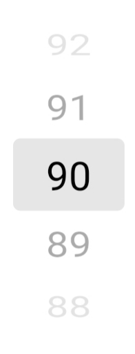
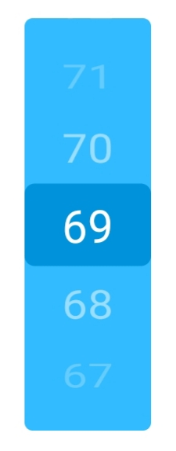
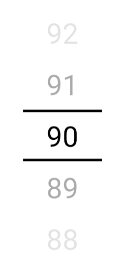
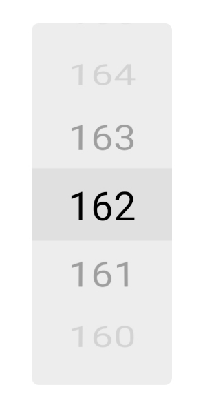
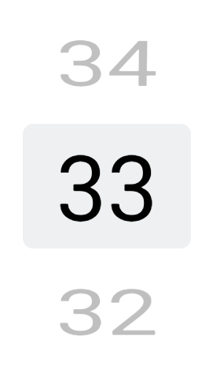
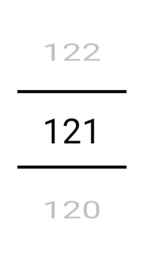
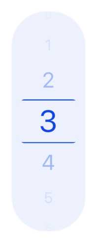

# react-native-wheely

Original repository: https://github.com/erksch/react-native-wheely

This fork adds ability to pass renderItem function to render custom options.

An all JavaScript, highly customizable wheel picker for react native.



## Installation

Install with yarn

```
yarn add 'react-native-wheely-picker'
```

## Usage

```jsx
import React, { useState } from 'react';
import { Text } from 'react-native'
import WheelPicker from 'react-native-wheely-picker';

function CityPicker() {
  const [selectedIndex, setSelectedIndex] = useState(0);

  return (
    <WheelPicker
      selectedIndex={selectedIndex}
      options={['Berlin', 'London', 'Amsterdam']}
      onChange={(index) => setSelectedIndex(index)}
      renderItem={(item) => {
        return <Text>{item}</Text>
      }}
    />
  );
}
```

## Props

| Name                     | Type                      | Description                                                                                                                                                                                                                                                                 |
| ------------------------ | ------------------------- | --------------------------------------------------------------------------------------------------------------------------------------------------------------------------------------------------------------------------------------------------------------------------- |
| `options`                | `any[]`                | Options to be displayed in the wheel picker. Options are rendered from top to bottom, meaning the first item in the options will be at the top and the last at the bottom.                                                                                                  |
| `selectedIndex`          | `number`                  | Index of the currently selected option.                                                                                                                                                                                                                                     |
| `onChange`               | `(index: number) => void` | Handler that is called when the selected option changes.                                                                                                                                                                                                                    |
| `visibleRest`            | `number`                  | Amount of additional options that are visible in each direction. Default is 2, resulting in 5 visible options.                                                                                                                                                              |
| `itemHeight`             | `number`                  | Height of each option in the picker. Default is 40.                                                                                                                                                                                                                         |
| `itemStyle`              | `StyleProp<ViewStyle>`    | Style for the option's container.                                                                                                                                                                                                                                                                                                                      |
| `containerStyle`         | `StyleProp<ViewStyle>`    | Style of the picker.                                                                                                                                                                                                                                                        |
| `selectedIndicatorStyle` | `StyleProp<ViewStyle>`    | Style of overlaying selected-indicator in the middle of the picker.                                                                                                                                                                                                         |
| `rotationFunction`       | `(x: number) => number `  | Function to determine the x rotation of items based on their current distance to the center (which is x). Default is  |
| `scaleFunction`          | `(x: number) => number `  | Function to determine the scale of items based on their current distance to the center (which is x). Default is %20=%201>)                                                            |
| `opacityFunction`        | `(x: number) => number`   | Function to determine the opacity of items based on their current distance to the center (which is x). Default is              |
| `decelerationRate`       | "normal", "fast", number  | How quickly the underlying scroll view decelerates after the user lifts their finger. See the [ScrollView docs](https://facebook.github.io/react-native/docs/scrollview.html#decelerationrate). Default is "fast".                                                          |
| `containerProps`         | `ViewProps`               | Props that are applied to the container which wraps the `FlatList` and the selected indicator.                                                                                                                                                                              |
| `flatListProps`          | `FlatListProps`           | Props that are applied to the `FlatList`.                                                                                                                                                                                                                                   |
| `renderItem`          | `renderItem: (option: any, index: number) => React.ReactElement`           | render option of the list                                                                                                                                                                                                                                  |
